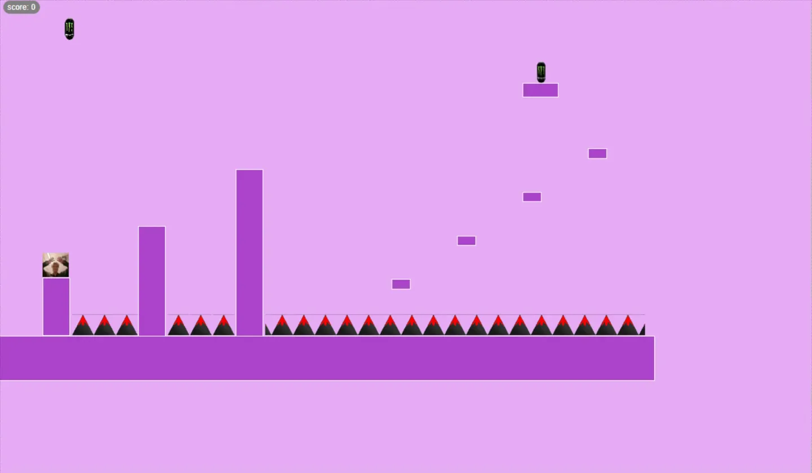

# learn2dgame-js

 beginner-friendly JavaScript library for learning 2D game development in the browser. Perfect for students, educators, and anyone wanting to learn javascript game development (Beginner Friendly).

 ## Clean code are written in this repository.

# Link To Final Version : https://github.com/Liberaa/module 
# Link To Working repository : https://github.com/Liberaa/NpmGamePackage 

## Features

- **Simple Player Movement** - WASD controls or platformer physics
- **Collision Detection** - AABB collision system with obstacles
- **Score System** - Built-in scoring with UI display
- **Scene Management** - Multiple levels/scenes support
- **Menu System** - Pause menus and game UI
- **Collectibles** - Coin collection system
- **No Dependencies** - Pure JavaScript, works in any modern browser

## Installation

```bash
npm install learn2dgame-js
```

### Option 1: With Vite (Recommended)

```bash
npm create vite@latest my-game -- --template vanilla
cd my-game
npm install learn2dgame-js
```

```javascript
import { Game, Obstacle, Coin, SceneManager, Menu, score } from 'learn2dgame-js'
```

### Option 2: Without a Build Tool

```bash
npm install learn2dgame-js
```

Create `index.html`:

```html
<!DOCTYPE html>
<html lang="en">
<head>
    <meta charset="UTF-8">
    <title>My Game</title>
</head>
<body>
    <script type="module" src="index.js"></script>
</body>
</html>
```

In `index.js`:

```javascript
import { Game, Obstacle, Coin, SceneManager, Menu, score } from './node_modules/learn2dgame-js/dist/learn2dgame-js.js'
```

Open with **Live Server** (VS Code extension) or any local development server.

## Quick Start

```javascript
import { Game, Obstacle, Coin, SceneManager } from 'learn2dgame-js'

const scenes = new SceneManager()

function level1() {
  new Obstacle({ positionX: 200, positionY: 500, width: 400, height: 50, color: 'brown' })
  new Coin({ positionX: 300, positionY: 450 })
}

scenes.add(level1, 20)
scenes.set(0)

new Game('platform', {
  movementSpeed: 10,
  jumpStrengthValue: 15,
  color: 'blue'
})
```

**Controls:**
- **A** = Move left
- **D** = Move right  
- **Space** = Jump

## API Reference

### Game

```javascript
new Game(controlScheme, options)
```

**Parameters:**
- `controlScheme`: `'wasd'` or `'platform'`
- `options`:
  - `movementSpeed` (number): Player speed (default: 8)
  - `gravityForce` (number): Gravity for platform mode (default: 0.5)
  - `jumpStrengthValue` (number): Jump power (default: 12)
  - `color` (string): Player color (default: 'red')

### Obstacle

```javascript
new Obstacle({ positionX, positionY, width, height, color, border })
```

Creates a platform or wall.

### Coin

```javascript
new Coin({ positionX, positionY, size })
```

Creates a collectible coin (worth 10 points).

### SceneManager

```javascript
const scenes = new SceneManager()
scenes.add(sceneFn, targetScore)  // Register scene
scenes.set(index)                 // Load scene
scenes.next()                     // Next scene
```

### Score

```javascript
import { score } from 'learn2dgame-js'

score.add(points)     // Add points
score.reset()         // Reset to 0
score.value           // Current score
```

### Menu

```javascript
const menu = new Menu()

menu.create({
  title: 'Pause Menu',
  buttons: [
    { text: 'Resume', onClick: () => menu.close() }
  ]
})

menu.close()
```

## Examples

### Multi-Level Game

```javascript
import { Game, Obstacle, Coin, SceneManager } from 'learn2dgame-js'

const scenes = new SceneManager()

function level1() {
  new Obstacle({ positionX: 200, positionY: 500, width: 300, height: 50, color: 'brown' })
  new Coin({ positionX: 300, positionY: 450 })
}

function level2() {
  new Obstacle({ positionX: 100, positionY: 500, width: 150, height: 50, color: 'green' })
  new Obstacle({ positionX: 350, positionY: 400, width: 150, height: 50, color: 'green' })
  new Coin({ positionX: 400, positionY: 350 })
}

scenes.add(level1, 20)
scenes.add(level2, 20)
scenes.set(0)

new Game('platform')
```

### Pause Menu

```javascript
import { Menu, score } from 'learn2dgame-js'

const menu = new Menu()

document.addEventListener('keydown', e => {
  if (e.key.toLowerCase() === 'm') {
    menu.create({
      title: 'Pause',
      buttons: [
        { text: 'Resume', onClick: () => menu.close() },
        { text: 'Reset Score', onClick: () => score.reset() }
      ]
    })
  }
})
```

### Level Design Tips

**Easy staircase:**
```javascript
new Obstacle({ positionX: 100, positionY: 500, width: 150, height: 50 })
new Obstacle({ positionX: 250, positionY: 450, width: 150, height: 50 })
new Obstacle({ positionX: 400, positionY: 400, width: 150, height: 50 })
```

**Gap jumping:**
```javascript
new Obstacle({ positionX: 100, positionY: 500, width: 150, height: 50 })
new Obstacle({ positionX: 350, positionY: 500, width: 150, height: 50 })
```

### WASD (Top-Down) Mode

```javascript
new Game('wasd', { movementSpeed: 5 })
```


## Known Issues

- **Double jump bug**: Spamming Space can trigger mid-air jumps
- **Menu overlap**: Menu persists if open during scene change

## License

MIT License - Perfect for learning and educational use!
https://github.com/Liberaa/NpmGamePackage/blob/main/LICENSE 

## Why This Library?

- **Learning Focused**: Understand game development step by step
- **No Complex Setup**: Just JavaScript and a browser
- **Simple Code**: Readable, modifiable source code
- **Quick Results**: Working game in minutes
- **Foundation Building**: Learn concepts for larger projects

## Example from Users


```javascript
import { Game, Obstacle, Coin, SceneManager } from 'learn2dgame-js'

const scenes = new SceneManager()

function level1() {
  // Ground
  new Obstacle({ positionX: -5, positionY: 780, width: 1500, height: 100 })
  
  // Starting platform with player spawn
  new Obstacle({ positionX: 100, positionY: 647, width: 60, height: 130 })
  
  // Deadly spike obstacles
  new Obstacle({ id: 'deadly', positionX: 168, positionY: 730, width: 50, height: 49, deadly: true })
  new Obstacle({ id: 'deadly', positionX: 218, positionY: 730, width: 50, height: 49, deadly: true })
  new Obstacle({ id: 'deadly', positionX: 268, positionY: 730, width: 50, height: 49, deadly: true })
  
  // Tall platform
  new Obstacle({ positionX: 320, positionY: 528, width: 60, height: 250 })
  
  // More spike obstacles
  new Obstacle({ id: 'deadly', positionX: 387, positionY: 730, width: 50, height: 49, deadly: true })
  new Obstacle({ id: 'deadly', positionX: 438, positionY: 730, width: 50, height: 49, deadly: true })
  new Obstacle({ id: 'deadly', positionX: 490, positionY: 730, width: 50, height: 49, deadly: true })
  
  // Very tall platform
  new Obstacle({ positionX: 543, positionY: 398, width: 60, height: 380 })
  
  // Long spike obstacle section
  new Obstacle({ id: 'deadly', positionX: 610, positionY: 730, width: 870, height: 49, deadly: true })
  
  // Disappearing platforms (vanish when player lands on them)
  new Obstacle({ id: 'disappear', positionX: 900, positionY: 650, width: 40, height: 20, color: 'orange', disappearOnLand: true })
  new Obstacle({ id: 'disappear', positionX: 1050, positionY: 550, width: 40, height: 20, color: 'orange', disappearOnLand: true })
  new Obstacle({ id: 'disappear', positionX: 1200, positionY: 450, width: 40, height: 20, color: 'orange', disappearOnLand: true })
  new Obstacle({ id: 'disappear', positionX: 1350, positionY: 350, width: 40, height: 20, color: 'orange', disappearOnLand: true })
  
  // High platform
  new Obstacle({ positionX: 1200, positionY: 200, width: 80, height: 30 })
  
  // Moving platform
  new Obstacle({ id: 'move-x', positionX: 1100, positionY: 100, width: 150, height: 30, velocityX: 2 })

  // Collectible coins
  new Coin({ positionX: 1230, positionY: 150 })
  new Coin({ positionX: 150, positionY: 50 })
}

scenes.add(level1, 10)
scenes.set(0)

new Game('platform', {
  movementSpeed: 5,
  jumpStrengthValue: 15,
  color: 'green'
})